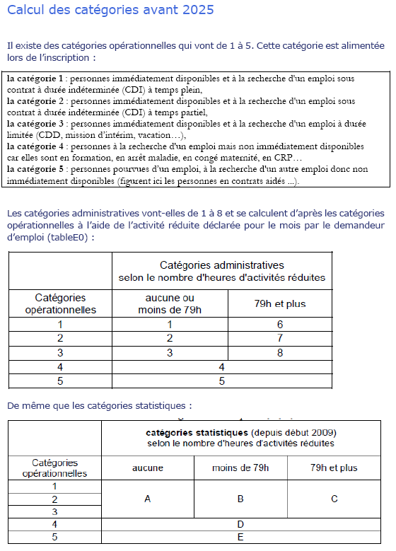
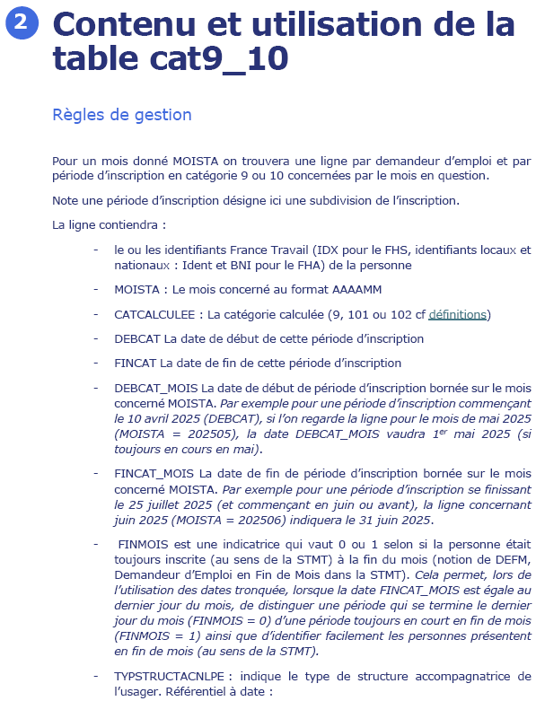
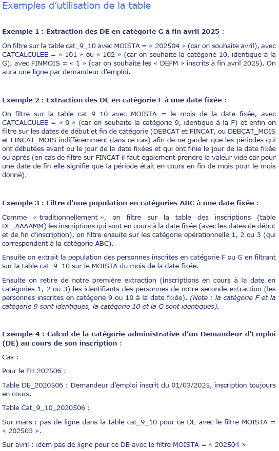
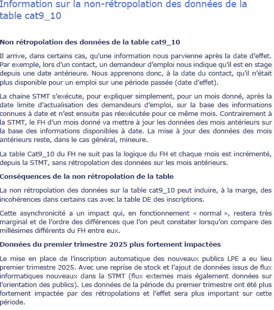

Cette table permet d'identifier les personnes inscrites en catégories F et G à France Travail. La fiche "Les catégories d'inscription dans le FHS" détaille comment l'utiliser.

](images/clipboard-4117134898.png)

](images/clipboard-3141993822.png)

](images/clipboard-710000128.png)

](images/clipboard-2619786572.png)
