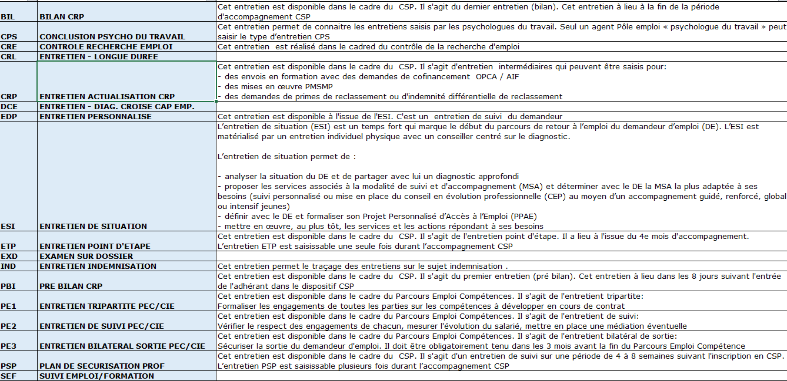

|  Variables |  Libellé |  Modalités |  Commentaires |
|:-----------------:|:------------:|:-------------------:|:---------------------:|
|  KD_DATEENTRETIEN |  Date de réalisation de l'entretien |   |  |
|  KC_TYPEENTRETIENAC_ID |  Type d'entretien |   Cf. image ci-dessous |  |
|  DC_LBLTYPEENTRETIENAC |  Libellé du type d'entretien |   Cf. image ci-dessous |  |
|  DC_MODALITECONTACT_ID |   Format de l'entretien réalisé |  |  |
|  DC_LBLCOMPLETMODALITEENTRETIEN |  Libellé du format de l'entretien réalisé |  |  |
|  DC_AGENT_REFERENT_H |   Identifiant du conseiller ayant effectué l'entretien |  |  |

Modalités de KC_TYPEENTRETIENAC_ID :

