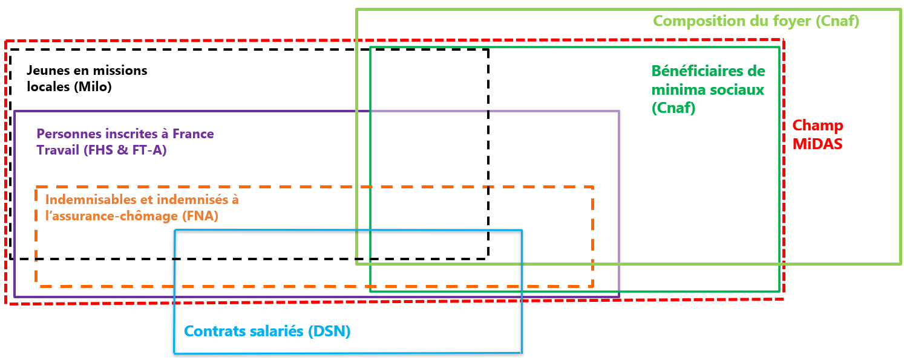

Le champ est le suivant selon les bases de données :

-   Du côté des **données de France Travail**, MiDAS comprend l'ensemble des personnes inscrites à France Travail au moins un jour depuis 2017, dont les indemnisables et indemnisés à l'assurance-chômage (AC) ;

-   Du côté des **données de la Cnaf**, MiDAS comprend l'ensemble des foyers sociaux bénéficiaires au moins un mois depuis 2017 du Revenu de solidarité active (RSA), de la prime d'activité (PA) et les personnes handicapées bénéficiaires de l'Allocation aux adultes handicapés (AAH) ;

-   Du côté des **données de la Dares,** MiDAS contient, parmi les MMO, tous les contrats salariés en cours ou terminés après le 1er janvier 2017 pour les individus du champ. MiDAS contient également les jeunes de 16-18 ans suivis par une Mission Locale depuis le 1er janvier 2017 dans les dispositifs suivants : Contrat d’Engagement Jeune (CEJ), Parcours contractualisé d’accompagnement vers l’emploi et l’autonomie (PACEA) et Garantie Jeune (GJ).

Le champ de MiDAS comprend ainsi les inscrits à France Travail (fichier FHS) dont les indemnisables et indemnisés (fichier FNA), auxquels sont appariés les bénéficiaires des minima sociaux (fichiers "Prestations") ainsi que les jeunes suivis par une Mission Locale (Milo). Les données MMO sont appariées à ce champ, de même que les données de la Cnaf portant sur la composition du ménage (fichiers "Ménages").

## Champ détaillé de chaque source

| Source | Champ des données |
|------------------------------------|------------------------------------|
| FHS | Inclut toute personne inscrite à France Travail au moins un jour depuis le 1er janvier 2017 avec son historique d'inscription remontant à 10 ans à la date d'extraction du fichier pour la France entière. |
| FNA | Inclut toutes les personnes indemnisables au moins 1 jour depuis le 1er janvier 2017. Pour ces individus, MiDAS contient tout l'historique de l'indemnisation depuis 1993, des périodes d'affiliation et de l'activité réduite. |
| Allstat-FR6 | Inclut l'ensemble des foyers sociaux bénéficiaires du RSA, de la PA et de l'AAH depuis janvier 2017 (fichier « Prestations ») pour la France entière. Ainsi, tout adulte seul ou membre d'un couple constitutif d'un foyer social qui perçoit un droit au RSA ou à la PA est suivi dans MiDAS quel que soit son âge. À noter l'absence des enfants de 18 à 25 ans qui vivent chez leurs parents, même si ces derniers appartiennent au foyer social bénéficiaire du RSA ou de la PA. Enfin, pour l'AAH, si son versement est soumis aux conditions de ressources du ménage , il s'agit d'une prestation individuelle et seul l'allocataire en est le bénéficiaire. Ainsi, son conjoint est conservé dans MiDAS s'il a été inscrit au moins une fois à France Travail ou si le couple a bénéficié du RSA ou de la PA depuis 2017. |
| MMO | Inclut l'ensemble des contrats salariés depuis le 1er janvier 2017 pour les individus du champ MiDAS. Les données sont représentatives de l'ensemble des établissements employeurs de [France métropolitaine]{.underline} sur le champ privé et public. Le champ recouvert par la DSN s'étant accru depuis 2017, l'exhaustivité des déclarations est meilleure en fin de période qu'en début de période. Les données portant sur les établissements de moins de 10 salariés sont également disponibles. Le champ de MiDAS comprendra de nouveaux publics à mesure qu'ils sont intégrés à la DSN. En revanche, MiDAS n'intègre pas les indépendants. |
| Milo | Inclut les jeunes de 16-28 ans suivis par les Missions Locales et présents dans les dispositifs suivants :  Contrat d’Engagement Jeune (CEJ), Parcours contractualisé d’accompagnement vers l’emploi et l’autonomie (PACEA) et Garantie Jeune (GJ). |
