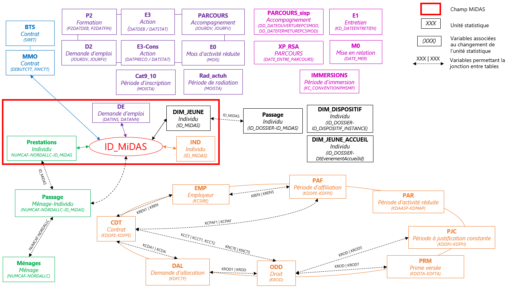

MiDAS (**Mi**nima Sociaux, **D**roits d'**A**ssurance-chômage, parcours **S**alariés) est un appariement de données administratives mené par la **Dares** (département Suivi et indemnisation des demandeurs d'emploi (D-Side)), en collaboration avec la Cnaf et France Travail. Cet appariement porte sur le **champ exhaustif, depuis le 1er janvier 2017 :**

-   Des personnes qui ont été inscrites à France Travail au moins une fois ;

-   De l'ensemble des foyers bénéficiaires de minima sociaux : Revenu de solidarité active (RSA), prime d'activité (PA), allocation aux adultes handicapés (AAH) ;

-   Des jeunes de 16-28 ans suivis par une Mission Locale et présents dans les dispositifs suivants : Contrat d’Engagement Jeune (CEJ), Parcours contractualisé d’accompagnement vers l’emploi et l’autonomie (PACEA) et Garantie Jeune (GJ).

La première vague est disponible depuis janvier 2023.

MiDAS regroupe ainsi les données :

-   De **France Travail**, qui permettent le suivi des inscrits à France Travail via le Fichier historique statistique (FHS) ainsi que le suivi de l'indemnisation des allocataires de l'assurance-chômage via le Fichier national des allocataires (FNA) ;

-   De la **Cnaf**, qui renseignent sur les bénéficiaires de prestations sociales via le fichier Allstat-FR6 ;

-   De la **Dares**, qui contiennent, d'une part, les contrats de travail (activité salariée), reconstitués dans les fichiers Mouvements de main-d'œuvre (MMO) à partir de la Déclaration sociale nominative (DSN) ; et, d'autre part, certains jeunes suivis en Mission locale présents dans la base IMILO.

::: callout-note
Les données IMILO (noir) et les données FTA (rose) constituent des modules complémentaires de l'appariement MiDAS. Il et possible d'y accéder en effectuant une demande à cette [page](https://cdap.casd.eu/).
:::

